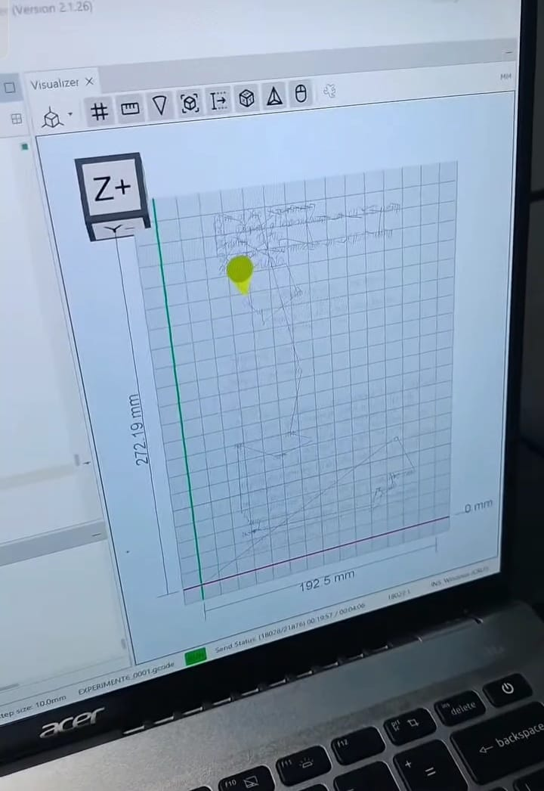

# ✏️ 2D CNC Writing Machine — GRBL + Arduino Uno

A DIY CoreXY plotting robot that can sketch, hand-write text, and draw diagrams — built on an Arduino Uno + CNC Shield running GRBL, with a servo-controlled pen lift.


---

## 📋 Overview

| | |
|---|---|
| 🧠 **Controller** | Arduino Uno + CNC Shield (A4988 drivers) |
| ⚙️ **Kinematics** | CoreXY |
| 🖊️ **Pen actuator** | MG90S micro servo |
| 🎨 **G-code source** | Inkscape 0.92 + Gcodetools |
| 📡 **G-code sender** | Universal G-code Sender (UGS) |

---

## 🧰 Component List

| Component | Qty | Notes |
|---|---|---|
| Arduino Uno | 1 | Main controller |
| CNC Shield v3 | 1 | Needed regardless of which parts kit you use below |
| A4988 stepper driver | 2 | One per axis |
| NEMA 17 stepper motor | 2 | X / Y axis drive |
| GT2 pulley + belt | 2 sets | CoreXY belt drive |
| M8 smooth rod | 4 pcs | Linear rails |
| M8 linear bearing (LM8UU) | 8 pcs | Rides on the rods |
| 3D printed frame parts | 1 set | 💰 Paid kit **or** 🆓 free STL files — see below |
| MG90S servo | 1 | Pen up/down |
| 12V 5A power adapter | 1 | Main power supply |
| USB cable | 1 | Flashing + UGS connection |

---

## 🖨️ 3D Printed Parts — Two Options

**Option A — 💰 Paid, ready-made kit**
A pre-printed ABS parts kit is available from various third-party sellers online — search "CNC plotter 3D printed parts kit" on your preferred marketplace.

**Option B — 🆓 Free, print-it-yourself**
Print the frame yourself using this open-source model:
📦 [`models/free-stl-model-kit.zip`](models/free-stl-model-kit.zip) — includes all STL files + assembly PDF

> ⚠️ Either option still requires a **CNC Shield purchased separately** — it is not included in either parts kit.

---

## 🔧 Build & Firmware Setup

### 1️⃣ Fix diagonal X/Y movement (CoreXY)
Out of the box, GRBL assumes independent X/Y axes. This machine is CoreXY, so a single axis command moves the pen diagonally unless CoreXY kinematics is enabled.

**Fix:** open `firmware/config.h` and uncomment:
```c
#define COREXY
```
Then recompile and upload via Arduino IDE.

> 💡 If your edit doesn't seem to take effect after uploading, check Arduino IDE's verbose compile log for `"Using previously compiled file"`. GRBL is an older-style library, so Arduino sometimes skips recompiling `.c` files after a header-only change. Fix: make a trivial edit (e.g. add a blank line) to each `.c` file to force a fresh compile.

### 2️⃣ Add pen-lift servo support
GRBL has no native servo support — the spindle PWM pin runs at the wrong frequency for a standard hobby servo. Use this servo-enabled GRBL fork instead:

📦 [`firmware/grbl-servo-master.zip`](firmware/grbl-servo-master.zip)

```gcode
M3 S60   ; pen up
M3 S0    ; pen down
```

---

## 🎨 Software & Downloads

| Tool | Purpose | Link |
|---|---|---|
| 🖥️ GRBL (official) | Base firmware | [github.com/gnea/grbl](https://github.com/gnea/grbl) |
| ✒️ grbl-servo | Servo-enabled firmware fork | included above |
| 🎨 Inkscape 0.92 | Design + G-code export | [inkscape.org/release/inkscape-0.92](https://inkscape.org/release/inkscape-0.92/) |
| 🧩 Inkscape plugins (4xiDraw & laser tools) | Hershey-text, hatch fill, line shading, box maker, living hinge, and more | 📦 [`software/inkscape-plugins-4xidraw-kmlaser.zip`](software/inkscape-plugins-4xidraw-kmlaser.zip) |
| 📡 Universal G-code Sender | Send G-code to the machine | [UGS v2.1.26 (win64)](https://github.com/winder/Universal-G-Code-Sender/releases/download/v2.1.26/win64-ugs-platform-app-2.1.26.zip) |

To install the Inkscape plugins: unzip `inkscape-plugins-4xidraw-kmlaser.zip` and copy all files into Inkscape's extensions folder (`Edit → Preferences → System → User extensions`), then restart Inkscape. New tools will appear under the **Extensions** menu.

---

## 📐 Calibration Fixes

### 📏 Drawing size doesn't match design size
Even with correctly calibrated `$100`/`$101` (steps/mm), Inkscape 0.92 + Gcodetools has a known bug: Inkscape internally uses 96 DPI, but Gcodetools' math assumes the older 90 DPI standard — causing every export to come out **~6.7% too large**.

**Fix:** before generating G-code, scale your whole design to **93.75%** (`90 ÷ 96`) in Inkscape — or scale the exported `.gcode` coordinates by `0.9375` afterward.
See [`gcode/TEXT_0003_corrected.gcode`](gcode/TEXT_0003_corrected.gcode) for a corrected example.

### ⚡ Drawing feels slow even at high feed rate
Two GRBL settings control speed — and for text/detailed drawings, **one matters far more than the other**:

| Setting | Role |
|---|---|
| `$110` / `$111` — max rate | Hard speed ceiling; GRBL never exceeds this |
| `$120` / `$121` — acceleration | How fast it *reaches* speed — dominant factor for short strokes like letters |

Since text is made of many short strokes, the machine rarely reaches top speed before slowing for the next corner — so **raising acceleration has a bigger real impact than raising max rate alone**.

---

## ⚙️ Reference Settings

```
$0   = 10       ; step pulse, usec
$3   = 3        ; dir port invert mask
$100 = 250.000  ; x steps/mm — calibrate with a ruler test for your build
$101 = 250.000  ; y steps/mm — calibrate with a ruler test for your build
$110 = 1500.000 ; x max rate, mm/min
$111 = 1500.000 ; y max rate, mm/min
$120 = 300.000  ; x acceleration, mm/sec²
$121 = 300.000  ; y acceleration, mm/sec²
```
*(Replace with your own final calibrated values.)*

---

## 🎯 Applications

- 🖼️ **Face sketching** — trace portrait line-art from a bitmap
- ✍️ **Handwriting simulation** — convert typed text into natural handwriting
- 📐 **Diagram making** — plot technical diagrams or illustrations

---

## 🖼️ Gallery

| Machine in action | UGS Visualizer preview |
|---|---|
|  |  |

---

## 🙏 Credits

- [GRBL](https://github.com/gnea/grbl)
- [grbl-servo firmware fork](firmware/grbl-servo-master.zip)
- [Gcodetools for Inkscape](https://inkscape.org)
- [Drawing Robot — Arduino Uno + CNC Shield + GRBL (free STL model)](https://www.printables.com/model/137296-drawing-robot-arduino-uno-cnc-shield-grbl/files#preview.file.izH9W)
