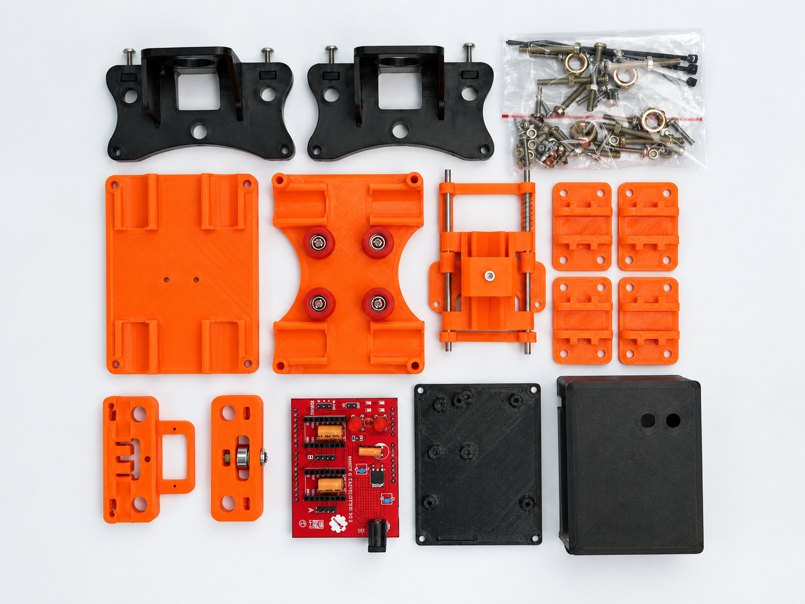
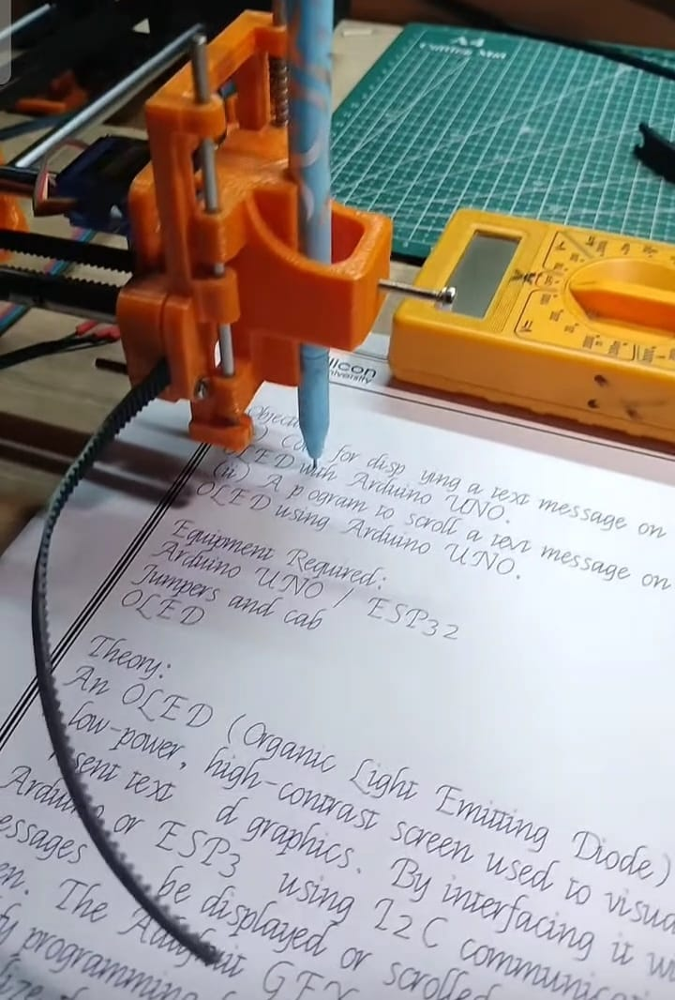

# 2D CNC Writing Machine (GRBL + Arduino Uno)

A DIY 2D CNC writing/plotting machine (EasyDraw V2-style CoreXY plotter) built on an Arduino Uno + CNC Shield running GRBL, with pen up/down control via an MG90S servo.



## Overview

- **Controller:** Arduino Uno + CNC Shield (A4988 drivers)
- **Firmware:** GRBL (CoreXY-patched) for motion, [`grbl-servo`](grbl-servo-master.zip) fork for pen-lift servo control
- **Kinematics:** CoreXY
- **Pen actuator:** MG90S micro servo
- **G-code source:** Inkscape 0.92 + Gcodetools extension
- **G-code sender:** Universal G-code Sender (UGS)

## Component List

| Component | Quantity | Notes / Source |
|---|---|---|
| Arduino Uno | 1 | Main controller |
| CNC Shield v3 | 1 | Stepper driver breakout board |
| A4988 stepper motor driver | 2 | One per axis (X/Y) |
| NEMA 17 stepper motor | 2 | X and Y axis drive |
| GT2 timing pulley + belt | 2 sets | CoreXY belt drive |
| M8 threaded rod (smooth/non-threaded) | 4 pcs | Linear motion rails |
| M8 linear bearing (LM8UU) | 8 pcs | Rides on the M8 rods |
| 3D printed parts kit (ABS) | 1 kit | [EasyDraw V2 2D Plotter parts kit – shopmakerq.com](https://shopmakerq.com/product/cnc-plotter-3d-printed-parts-kit/?srsltid=AfmBOorJEgRL87GRTpUh_m8fN5zNQv1IVdzcSez_7XhsyYk16ucyBQryKzo) (paid) — **or** print the free STL files yourself, see [Free 3D Model Alternative](#free-3d-model-alternative) below |
| MG90S servo motor | 1 | Pen up/down actuator |
| 12V 5A power adapter | 1 | Main power supply |
| USB cable (Arduino Uno) | 1 | For flashing and UGS connection |
| Misc. screws, nuts, zip ties | — | Included in parts kit hardware bag |


## Free 3D Model Alternative

If you don't want to buy the paid 3D printed parts kit, you can print your own set for free using this open model instead:

**[Drawing Robot – Arduino Uno + CNC Shield + GRBL by Plexi (Printables.com)](https://www.printables.com/model/137296-drawing-robot-arduino-uno-cnc-shield-grbl/files#preview.file.izH9W)**

The STL files (and enclosure, pen holder, slider, and clamshell parts) are included in this repo under [`3d-models/`](3d-models/drawing-robot-arduino-uno-cnc-shield-grbl-model_files.zip) for convenience.

> ⚠️ **Note:** this free model does **not** include a CNC Shield — you'll need to buy one separately (see [Component List](#component-list) above). The model is designed around an Arduino Uno + CNC Shield combo, so the shield still needs sourcing on its own regardless of which parts kit (paid or free) you use.

## Software / Downloads

| Tool | Link |
|---|---|
| GRBL (official) | [github.com/gnea/grbl](https://github.com/gnea/grbl) |
| grbl-servo fork (pen-lift support) | included in this repo — [`grbl-servo-master.zip`](grbl-servo-master.zip) |
| Inkscape 0.92 (with Gcodetools) | [inkscape.org/release/inkscape-0.92](https://inkscape.org/release/inkscape-0.92/) |
| Universal G-code Sender (UGS) | [v2.1.26 release (win64)](https://github.com/winder/Universal-G-Code-Sender/releases/download/v2.1.26/win64-ugs-platform-app-2.1.26.zip) |


## The Diagonal Movement Problem

Initially, commanding a pure X or Y move caused diagonal pen movement. Root cause: this is a **CoreXY** machine, but stock GRBL was compiled with CoreXY kinematics disabled.

**Fix:** in `firmware/config.h`, uncomment:
```c
#define COREXY
```

> Note: if you edit `config.h` and re-upload but nothing changes, check your Arduino IDE's verbose compile log for `"Using previously compiled file"` — legacy-format libraries like GRBL don't always trigger a recompile from a header-only change. Forcing a trivial edit to each `.c` file (e.g. an extra blank line) resolves it.

## Firmware Setup

1. Download GRBL from [github.com/gnea/grbl](https://github.com/gnea/grbl)
2. Replace `config.h` with the version in [`/firmware`](firmware/config.h) (CoreXY enabled)
3. Copy the `grbl` folder into your Arduino `libraries` directory
4. Open `grbl/examples/grblUpload/grblUpload.ino` in Arduino IDE, select Board: Uno, and upload

## Servo Pen-Lift Setup

GRBL has no native servo support — spindle PWM (`M3 Sxxx`) runs at the wrong frequency for a standard hobby servo (MG90S/SG90 expect 50Hz pulses; GRBL's Timer2 PWM runs at ~1kHz), so driving the servo directly off the spindle pin doesn't work reliably.

**Solution used:** [`grbl-servo`](grbl-servo-master.zip) — a GRBL fork with native RC-servo pulse generation on the spindle pin.

```
M3 S60   ; pen up
M3 S0    ; pen down
```

## G-code Scaling Fix

Drawings came out ~6.7% larger than designed, despite correct `$100`/`$101` (steps/mm) calibration confirmed by direct ruler measurement.

**Root cause:** Inkscape 0.92 uses 96 DPI internally; the Gcodetools extension's math assumes the older 90 DPI standard. This produces a consistent `96/90 ≈ 1.0667×` oversizing on every export, regardless of machine calibration.

**Fix:** scale the design by `93.75%` (`90/96`) before generating G-code, or post-process the exported `.gcode` file by multiplying every X/Y coordinate by `0.9375`. See [`gcode/`](gcode/) for a before/after example.

## Speed Tuning

Two separate settings control drawing speed:

| Setting | What it does |
|---|---|
| `F` value in G-code (set via the pen-plot Inkscape extension) | Requested speed |
| `$110`/`$111` (GRBL max rate) | Hard ceiling — GRBL never exceeds this regardless of requested `F` |
| `$120`/`$121` (GRBL acceleration) | How fast the machine can ramp to speed — dominant factor for short strokes like text |

For text/detailed drawings made of many short strokes, **acceleration matters more than max rate** — the machine rarely reaches top speed on short segments, so raising acceleration has a bigger real-world impact than raising max rate alone.

## Final Settings

```
$0 = 10         (step pulse, usec)
$3 = 3          (dir port invert mask)
$100 = 250.000  (x, step/mm)     ; calibrated via ruler test — adjust for your build
$101 = 250.000  (y, step/mm)     ; calibrated via ruler test — adjust for your build
$110 = 1500.000 (x max rate, mm/min)
$111 = 1500.000 (y max rate, mm/min)
$120 = 300.000  (x accel, mm/sec^2)
$121 = 300.000  (y accel, mm/sec^2)
```

*(Fill in your actual final values here.)*

## Applications

This machine can be used for:

- ✏️ **Face sketching** — tracing portrait line-art from a bitmap image
- 🖊️ **Handwriting simulation** — converting typed text into natural-looking handwritten notes
- 📐 **Diagram making** — plotting technical diagrams, schematics, or hand-drawn-style illustrations

## Gallery

| Machine in action | UGS Visualizer preview |
|---|---|
|  |  |

## Credits

- [GRBL](https://github.com/gnea/grbl)
- [grbl-servo](grbl-servo-master.zip)
- [Gcodetools for Inkscape](https://inkscape.org)
- [EasyDraw V2 3D printed parts kit – shopmakerq.com](https://shopmakerq.com/product/cnc-plotter-3d-printed-parts-kit/?srsltid=AfmBOorJEgRL87GRTpUh_m8fN5zNQv1IVdzcSez_7XhsyYk16ucyBQryKzo)
